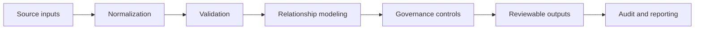

# From Fragile Spreadsheet to Governed RHEL Upgrade Delivery

This repository is a sanitized portfolio demonstration of enterprise RHEL
upgrade planning and delivery governance work. It uses only synthetic data.

The public demo shows how hidden spreadsheet assumptions can be converted into
explicit validation, relationship modeling, review gates, and repeatable
outputs. It is not a claim that this repository contains the original enterprise
code or production data.

## The Problem

Enterprise OS upgrade planning was being coordinated through a complex tracker
with assumptions spread across ownership, readiness, scheduling, change/task
relationships, dependencies, and reporting.

Excel was not the problem. The workflow had grown beyond what a manually
maintained tracker could safely govern on its own.

## Why It Mattered

The risks addressed by the workflow included:

- invalid or missing ownership,
- scheduling errors,
- missing change/task relationships,
- inconsistent assumptions,
- unreliable reporting,
- difficult reruns,
- limited auditability,
- and downstream rework.

These are risk categories addressed by the governed workflow, not claims that
each risk occurred in production.

## Derek's Role

Derek's role was program and workflow leadership: clarifying requirements,
exposing hidden tracker assumptions, designing governance controls, guiding
AI-assisted implementation with Claude Code, reviewing outputs, testing
behavior, and shaping delivery decisions.

AI accelerated implementation. It did not replace human accountability,
operating-context judgment, or acceptance decisions.

## Solution

The curated demonstration includes:

- validated baseline datasets,
- explicit schemas,
- deterministic transformations,
- change/task relationship modeling,
- audit guardrails,
- workflow review gates,
- repeatable runs,
- exception reporting,
- and human-review checkpoints.

## Architecture



## Run The Audit-Safe Demo

```bash
./scripts/run_demo.sh
```

Expected result:

- deterministic classification of ready and exception records
- explicit review reasons for held records
- safe separation of wave-review records from human-review exceptions
- generated output in `outputs/demo_output.csv`
- generated exception report in `outputs/exception_report.csv`

## Technical Proof

The demo is intentionally small, but it proves the core pattern:

1. Read controlled input files.
2. Validate required schema and uniqueness.
3. Join inventory to change/task records by server identifier.
4. Apply deterministic governance controls.
5. Separate ready records from human-review exceptions.
6. Produce repeatable CSV outputs.

## What This Demonstrates

This case study demonstrates TPM capabilities in:

- ambiguity reduction,
- technical depth,
- cross-functional translation,
- risk management,
- data governance,
- process design,
- enterprise change delivery,
- AI-enabled execution,
- and operational judgment.

## Privacy

All data in this repository is synthetic. Real company names, server names,
application names, user names, internal URLs, tickets, schedules, owner
assignments, and production data have been excluded.

Run the public-export scanner before publishing:

```bash
./scripts/verify_public_export.sh
```

## Status

This repository is publication-ready only after human review of the sanitized
content and explicit approval to publish.
