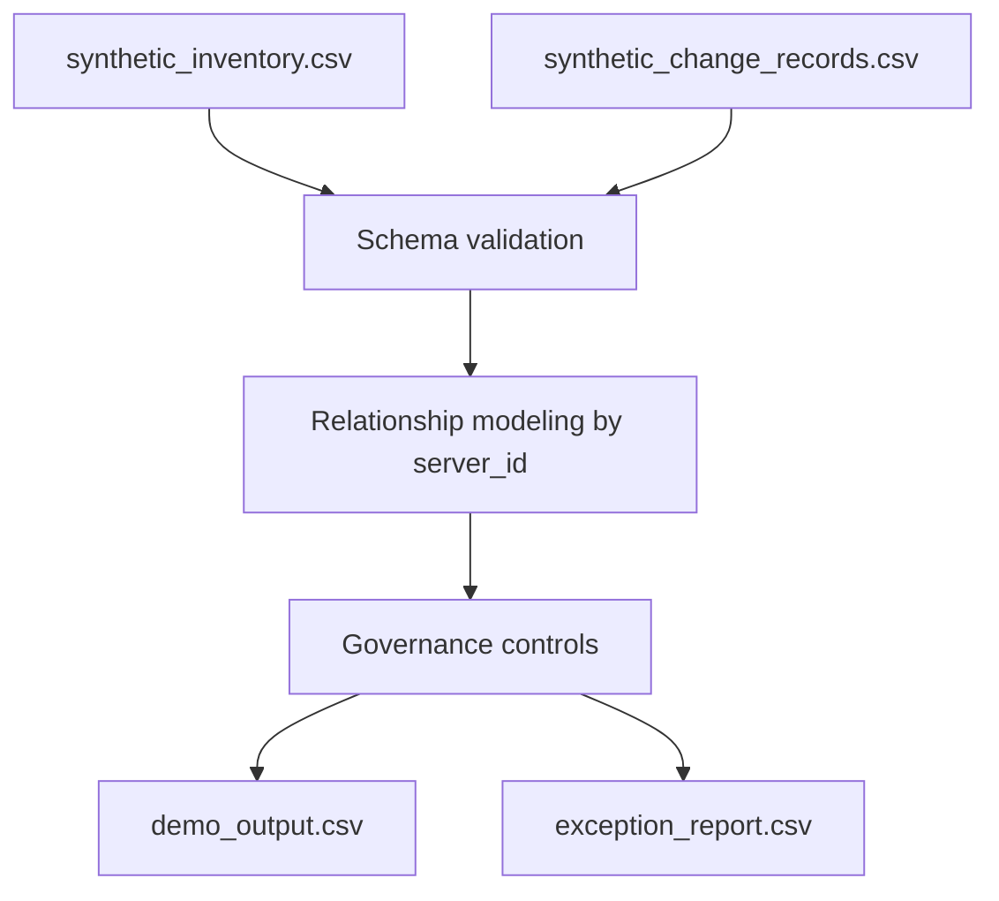

# Architecture

The demo architecture is intentionally simple.

## Components

- `examples/synthetic_inventory.csv`: sanitized inventory baseline.
- `examples/synthetic_change_records.csv`: sanitized change/task records.
- `src/rhel_upgrade_governance/pipeline.py`: deterministic validation and
  governance logic.
- `scripts/run_demo.sh`: one-command synthetic run.
- `scripts/verify_public_export.sh`: privacy and publication scanner.

## Design Choices

- CSV inputs keep the demo transparent to technical and nontechnical reviewers.
- The pipeline uses the Python standard library only.
- Governance reasons are explicit strings, not hidden formulas.
- Exception output is first-class, because human review is part of the control
  model.

